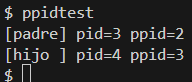

# INFORME — Tarea 1 (xv6-riscv)

### Integrantes:
- Bastián De La Fuente
- Dubalio Pérez

## 1) Funcionamiento de las llamadas al sistema (nivel medio)

- Un programa en modo usuario invoca una función (por ejemplo, getppid).
- Un “stub” de usuario arma la llamada: coloca el número del syscall en el registro a7, los argumentos en a0..a5 y ejecuta ecall (cambio a modo kernel).
- El kernel entra por usertrap y llama a syscall.
- syscall consulta una tabla que mapea número de syscall → función del kernel y despacha a la rutina correspondiente (por ejemplo, sys_getppid).
- La rutina del kernel hace el trabajo y deja el valor de retorno en a0.
- Se restaura el contexto y se vuelve a modo usuario; la función en user space recibe el valor de retorno.

---

## 2) Cambios realizados para getppid

- kernel/sysproc.c: se implementó la función del kernel que devuelve el pid del proceso padre del actual; si no hay padre, devuelve −1.  
- kernel/syscall.h: se reservó un número nuevo para identificar la syscall getppid.  
- kernel/syscall.c: se declaró y registró getppid en la tabla que asocia números de syscall con funciones del kernel.  
- user/user.h: se declaró getppid para que los programas de usuario puedan llamarla.  
- user/usys.pl: se agregó la entrada para que se genere el “puente” (stub) de usuario.  
- Makefile y user/ppidtest.c: se añadió un programa de prueba que imprime su pid y el de su padre, y luego hace un fork para comprobar que el hijo hereda como padre al proceso que lo creó.

**Cómo probar**
```sh
make clean
make qemu-nox
$ ppidtest
```

**Y esto seberia dar:**



## 2) Cambios realizados para getancestor

## 4) Dificultades y cómo se resolvieron

- Ejecutar make dentro de xv6 (shell del SO) provoca “exec make failed”.  
  Solución: salir de QEMU y correr make en la terminal del host (WSL/Ubuntu en VSCode).

- El ejecutable de prueba no aparece en el shell.  
  Solución: agregar el programa a UPROGS en el Makefile y recompilar.


